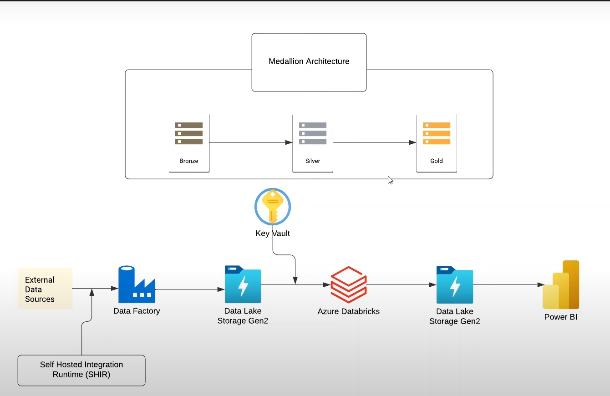

# 🚓 Vehicle Theft Medallion Pipeline (Azure Databricks + ADLS Gen2 + ADF + Power BI)

## 📖 Overview

An end‑to‑end data engineering project that implements the **Medallion Architecture (Bronze → Silver → Gold)** for stolen‑vehicle data. Raw data is copied from a **local PC** to **Azure Data Lake Storage Gen2 (ADLS Gen2)** using **Azure Data Factory (ADF) with a Self‑Hosted Integration Runtime (SHIR)**. Data is then transformed in **Azure Databricks** and written to **Silver** and **Gold** layers. Finally, the **Gold** data powers **Power BI** dashboards.

```
Local PC  →  ADF  →  ADLS Gen2 (Bronze)  →  Databricks (Transform)  →  ADLS Gen2 (Silver → Gold)  →  Power BI
```
---

## 🏗️ Architecture

Below is the high-level architecture diagram of the Vehicle Theft Medallion Pipeline:



The architecture shows the complete data flow from source to visualization:
1. Data ingestion from local source via ADF SHIR
2. Bronze layer storage in ADLS Gen2
3. Transformation in Databricks
4. Silver and Gold layer storage
5. Final visualization in Power BI

---

## 🧰 Tech Stack

* **Azure Data Factory** – Copy activity via **Self‑Hosted IR** from local filesystem to ADLS Gen2
* **Azure Databricks** – PySpark + Delta for transformations
* **ADLS Gen2** – Data lake storage for Bronze/Silver/Gold
* **Azure Key Vault** + **Databricks Secret Scope** – Secure credential management
* **Power BI** – Dashboards on Gold layer

---

## 🗂️ Medallion Layers

* **Bronze**: Raw, immutable copy of the source files from local PC (landed by ADF)
* **Silver**: Cleaned & conformed tables (schema enforcement, null handling, type casting)
* **Gold**: Business‑ready data models for analytics/reporting (denormalized, curated)

---

## 🔐 Secure Connectivity (Key Vault + abfss)

Use direct **`abfss://`** access (no mounts) and fetch secrets from a Databricks **secret scope** linked to **Azure Key Vault**.

```python
# Databricks: configure once per cluster/session
spark.conf.set(
    "fs.azure.account.key.vehicletheftvarad.dfs.core.windows.net",
    dbutils.secrets.get("dbScope", "saSecret")  # storage account key or SAS
)
```

> Replace `dbScope` and `saSecret` with your actual scope & secret names.

---

## 🔄 Pipeline Steps

### 1) Ingest to **Bronze** with ADF (Self‑Hosted IR)

* Source: Local PC folder/files
* Sink: `abfss://bronze@vehicletheftvarad.dfs.core.windows.net/<dataset>/`
* Activity: **Copy** (preserve raw structure & file names)

### 2) Transform in **Databricks** to **Silver**

* Read Bronze data into DataFrames using Spark
* Apply schema definitions for each dataset (vehicles, locations, theft records)
* Transformations performed:

  * **Casting & type enforcement** (integers, dates, strings)
  * **Null handling**:

    * Replace numeric nulls with `-1`
    * Replace string nulls with `"Unknown"`
    * Replace null dates with default `1900-01-01`
  * **Column standardization** (renaming columns, trimming whitespace)
  * **Data validation** (dropping invalid records where required)

Example transformation (stolen\_vehicles\_df):

```python
from pyspark.sql.functions import lit, coalesce, to_date

# Null handling
stolen_vehicles_df = stolen_vehicles_df.fillna({
    "vehicle_id": -1,
    "make_id": -1,
    "model_year": -1,
    "location_id": -1,
    "vehicle_type": "Unknown",
    "vehicle_desc": "Unknown",
    "color": "Unknown"
})

stolen_vehicles_df = stolen_vehicles_df.withColumn(
    "date_stolen", coalesce(stolen_vehicles_df["date_stolen"], to_date(lit("1900-01-01")))
)

# Write to Silver
stolen_vehicles_df.write.format("delta").mode("overwrite").save(
    "abfss://silver@vehicletheftvarad.dfs.core.windows.net/stolen_vehicles/"
)
```

### 3) Curate **Gold**

* Combine multiple Silver tables (vehicles, locations, theft records) into unified curated datasets
* Perform business aggregations such as:

  * Theft counts by **year**
  * Theft counts by **vehicle type**
  * Theft counts by **location**
* Store results in Gold container for reporting

Example:

```python
from pyspark.sql.functions import year, count

gold_vehicle_thefts_by_year = (
    stolen_vehicles_df
        .withColumn("year", year("date_stolen"))
        .groupBy("year")
        .agg(count("vehicle_id").alias("thefts"))
)

gold_vehicle_thefts_by_year.write.format("delta").mode("overwrite").save(
    "abfss://gold@vehicletheftvarad.dfs.core.windows.net/vehicle_thefts_by_year/"
)
```

### 4) **Power BI** on Gold

* Option A: **Azure Databricks connector** to Delta tables (recommended for Delta)
* Option B: **ADLS Gen2** connector to Gold folders (Parquet/CSV)
* Build visuals & publish dashboard

---

## 🧱 Dataset (Schema)

* **Vehicles**: `vehicle_id`, `vehicle_type`, `make_id`, `model_year`, `vehicle_desc`, `color`, `date_stolen`, `location_id`
* **Locations**: `location_id`, `city`, `state`, `zip`
* **Thefts**: transaction‑level facts, joined with vehicle & location dimensions

**Null fill strategy used**

* Integers → `-1`
* Strings → `"Unknown"`
* Date → `1900-01-01`


---

## 🚀 How to Run

1. **Provision** ADLS Gen2, Databricks workspace, Azure Key Vault.
2. **Create** a Databricks secret scope mapped to Key Vault; store account key/SAS as `saSecret`.
3. **ADF setup**: Install **Self‑Hosted IR** on a machine that can access the local files. Create **Copy** pipeline to Bronze.
4. **Databricks**: Import notebooks, attach cluster, set the `spark.conf` with secrets, run Bronze→Silver→Gold jobs.
5. **Power BI**: Connect to Gold via Databricks (Delta) or ADLS Gen2 (Parquet/CSV) and build dashboards.

---

## 📈 Future Enhancements

* Parameterize ADF pipelines & add triggers/schedules
* Add quality checks (Great Expectations, Deequ)
* Partition & optimize Delta tables (Z‑Order, Optimize, Vaccum)
* Orchestrate with Databricks Workflows / Azure Data Factory pipelines
* Add CI/CD for notebooks & ADF assets

---

## 👤 Author

**Varad Brahmapurkar**
